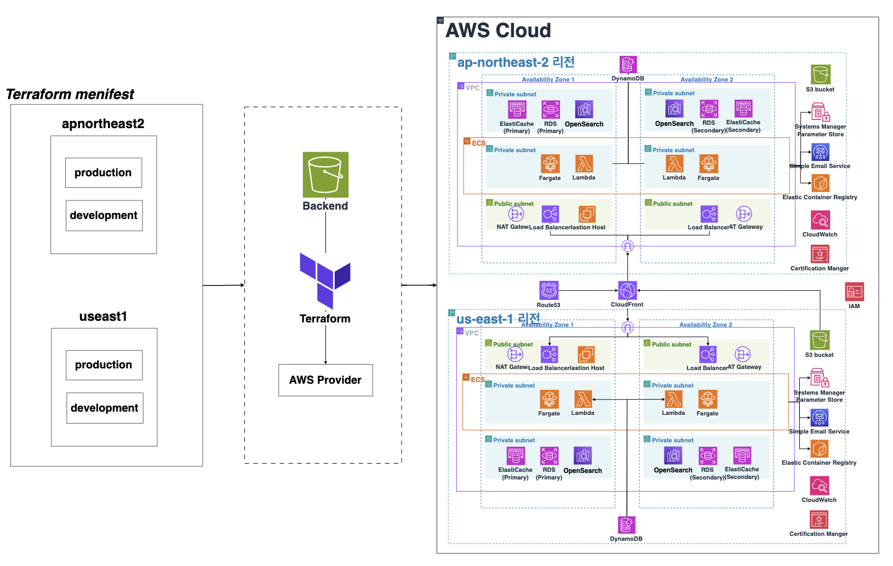

# Terraform을 사용한 인프라 구축 및 관리

<p align="center"></p>

---
## 인원 및 기간
- 인원: 1명
  - 🙋‍♂ 고진혁([KJH0476](https://github.com/KJH0476))
  - 해당 프로젝트는 학습 목적으로 개인이 진행한 프로젝트입니다.
- 기간: - `2025.02.07` ~ `2025.03.10`(1달)

## 배경
해당 클라우드 프로젝트를 진행하며 처음 써보는 AWS 리소스도 많고, 생각치도 못한 에러가 많이 발생해서 리소스 생성 및 삭제를 많이 반복하게 되었습니다.</br>
이로 인해, 불필요한 비용이 많이 발생하고 인프라를 구축하는데 시간이 많이 소요되었습니다. 또한, 변경 사항을 추적할 수 없어 불편함을 느꼈습니다.
이러한 문제를 해소하기 위해 Terraform을 활용하여 클라우드 인프라를 코드로 관리하는 방법을 학습했습니다. Terraform을 사용함으로써 인프라 구성을 자동화하고, 변경 사항을 버전으로 관리하여 이력을 쉽게 추적할 수 있으며, 이를 통해 클라우드 환경을 효율적이고 안정적으로 구축하고자 하였습니다.

- **복잡한 의존성 관리**  
  - 예를 들어, ECS Exec Role과 KMS 리소스 정책은 서로의 ARN(고유 식별자)이 필요합니다. 이러한 상호 의존성을 안전하게 관리하기 위해 리소스 생성 순서를 명확히 해야 했습니다.

- **효율적인 마이크로서비스 배포**  
  - 마이크로서비스 아키텍처에서는 여러 개의 ECS Task와 Service를 한 번에 생성해야 하는 경우가 많습니다. 이를 위해 `tpl.json` 템플릿 파일과 변수 모듈화를 도입하여 코드 중복을 줄이고 확장성을 높였습니다.

- **리전 및 환경별 독립성 확보**  
  - 리전 및 환경별(prod, dev) 모두 동일한 모듈 구조를 재사용하되, 변수 주입을 통해 각 환경에 맞게 독립적으로 인프라를 구성할 수 있도록 설계했습니다.

## 설계 목표 및 고려 사항

### 1. 모듈화 및 단일 책임 원칙 적용
- **Common 모듈**
    - *주요 구성 요소:* ECS 클러스터, ECS Exec Role, ACM, SES
    - ECS Exec Task Role과 KMS 리소스 정책은 서로의 ARN이 필요하므로, Common 모듈에서 ECS Exec Task Role을 생성하고, 다른 모듈에서 이를 참조하도록 설계하였습니다.
    - ECS 실행 역할에 필요한 정책은 iam 모듈에서 따로 관리되도록 하였습니다.

- **서비스별 독립 모듈**  
  - 각 기능(IAM, KMS, Route53 레코드, DB, Lambda, ECS, EC2(Bastion), 웹(CloudFront, S3))을 별도 모듈로 분리하여 관리함으로써, 모듈 업데이트 시 다른 리소스에 미치는 영향을 최소화하였습니다.

### 2. 효율적이고 확장 가능한 마이크로서비스 배포
- **템플릿 기반 구성 관리 (`tpl.json`)**  
  -  다수의 ECS Task와 Service를 동적으로 생성할 필요가 있는 마이크로서비스 환경에 맞춰, 템플릿 파일과 변수 설정을 통해 구성 정보를 모듈화하였습니다.

- **리전별 환경별 변수 주입**  
  - 멀티 리전 환경을 위해 먼저 리전별로 구분한 후, 동일한 모듈 구조를 활용하여 각 리전의 Prod, Dev 등 환경별 요구사항에 맞춘 변수 주입 방식으로 인프라를 개별적으로 생성하도록 설계하였습니다.

### 3. 의존성 및 실행 순서 관리
- **순서**
  - `route53 (apno2: hosting zone) + network (VPC, Subnet, SG, NAT, RT) + common (ACM, Route53 CNAME, ECS 클러스터, ECS Exec Role, ECR, SES)`</br>
    → `kms + database + load_balancer + bastion + web (use1: Cloudfront, S3)`</br>
    → `iam + lambda + ssm`</br>
    → `ecs`

위의 실행 순서를 통해 기반 인프라부터 애플리케이션 레이어까지 안정적으로 구축되며, 각 단계의 모듈이 순차적으로 실행되어 명확하고 효율적인 구조를 갖추도록 설계하였습니다.

## 파일 구조
```shell
.
├── README.md
├── _module
│   ├── bastion
│   │   ├── main.tf
│   │   ├── outputs.tf
│   │   └── variables.tf
│   ├── common
│   │   ├── main.tf
│   │   ├── outputs.tf
│   │   └── variables.tf
│   ├── database
│   │   ├── main.tf
│   │   ├── outputs.tf
│   │   └── variables.tf
│   ├── ecs
│   │   ├── main.tf
│   │   ├── outputs.tf
│   │   ├── task_definition.tpl.json
│   │   └── variables.tf
│   ├── iam
│   │   ├── main.tf
│   │   ├── outputs.tf
│   │   └── variables.tf
│   ├── kms
│   │   ├── main.tf
│   │   ├── outputs.tf
│   │   └── variables.tf
│   ├── lambda
│   │   ├── main.tf
│   │   ├── outputs.tf
│   │   └── variables.tf
│   ├── lb
│   │   ├── main.tf
│   │   ├── outputs.tf
│   │   └── variables.tf
│   ├── network
│   │   ├── main.tf
│   │   ├── outputs.tf
│   │   └── variables.tf
│   ├── route53
│   │   ├── main.tf
│   │   ├── outputs.tf
│   │   └── variables.tf
│   ├── ssm
│   │   ├── main.tf
│   │   ├── outputs.tf
│   │   └── variables.tf
│   └── web
│       ├── main.tf
│       ├── outputs.tf
│       └── variables.tf
├── apnortheast2
│   └── env
│       ├── dev
│       │   ├── backend.tf
│       │   ├── bastion_ssh_key
│       │   │   ├── dev-apn2-bastion-key
│       │   │   └── dev-apn2-bastion-key.pub
│       │   ├── lambda_functions
│       │   │   ├── lambda_fucntion.py
│       │   │   └── lambda_function.zip
│       │   ├── main.tf
│       │   ├── outputs.tf
│       │   ├── provider.tf
│       │   ├── terraform.tfvars
│       │   └── variables.tf
│       └── prod
│           ├── backend.tf
│           ├── bastion_ssh_key
│           │   ├── prod-apn2-bastion-key
│           │   └── prod-apn2-bastion-key.pub
│           ├── lambda_functions
│           │   ├── lambda_fucntion.py
│           │   └── lambda_function.zip
│           ├── main.tf
│           ├── outputs.tf
│           ├── provider.tf
│           ├── terraform.tfvars
│           └── variables.tf
├── init
│   ├── init.tf
│   └── terraform.tfstate
└── useast1
    └── env
        ├── dev
        │   ├── backend.tf
        │   ├── bastion_ssh_key
        │   │   ├── dev-use1-bastion-key
        │   │   └── dev-use1-bastion-key.pub
        │   ├── lambda_functions
        │   │   ├── lambda_fucntion.py
        │   │   └── lambda_function.zip
        │   ├── main.tf
        │   ├── outputs.tf
        │   ├── provider.tf
        │   ├── terraform.tfvars
        │   └── variables.tf
        └── prod
            ├── backend.tf
            ├── bastion_ssh_key
            │   ├── prod-use1-bastion-key
            │   └── prod-use1-bastion-key.pub
            ├── cloudfront_functions
            │   └── cloudfront_function.js
            ├── lambda_functions
            │   ├── lambda_fucntion.py
            │   └── lambda_function.zip
            ├── main.tf
            ├── outputs.tf
            ├── provider.tf
            ├── terraform.tfvars
            └── variables.tf
```
