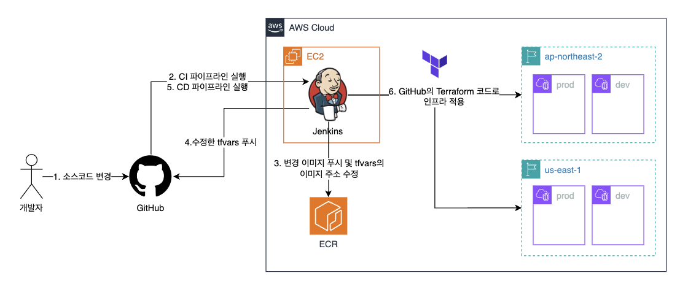
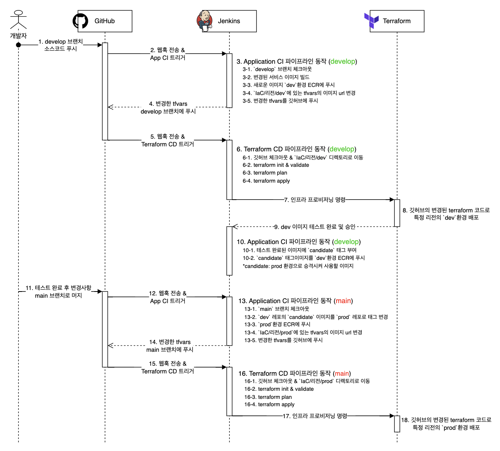
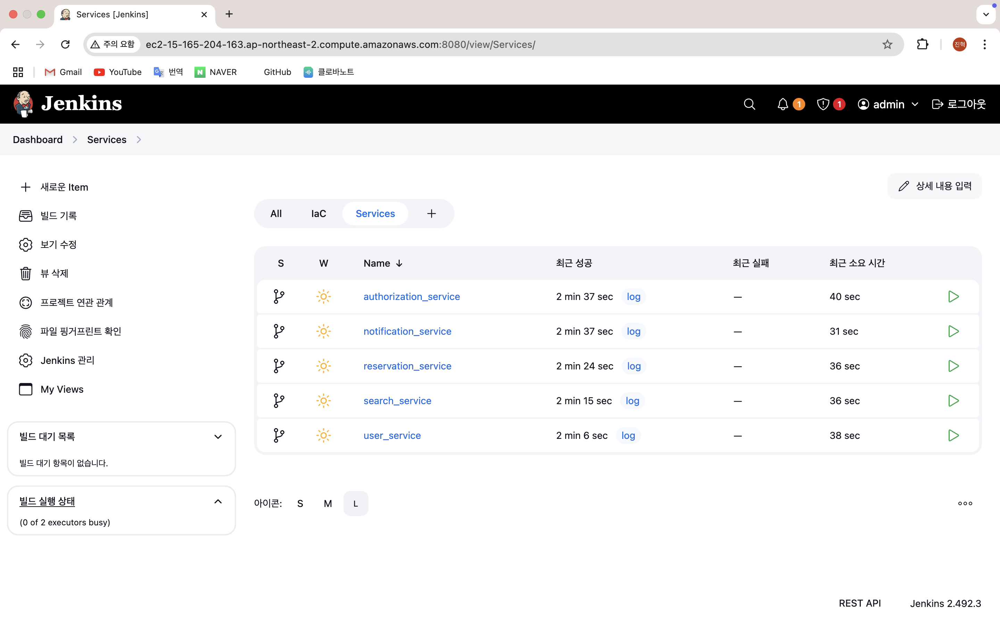
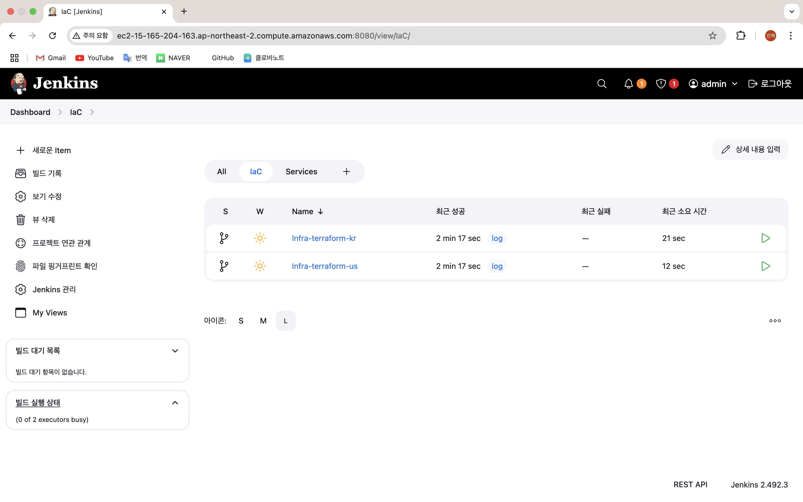
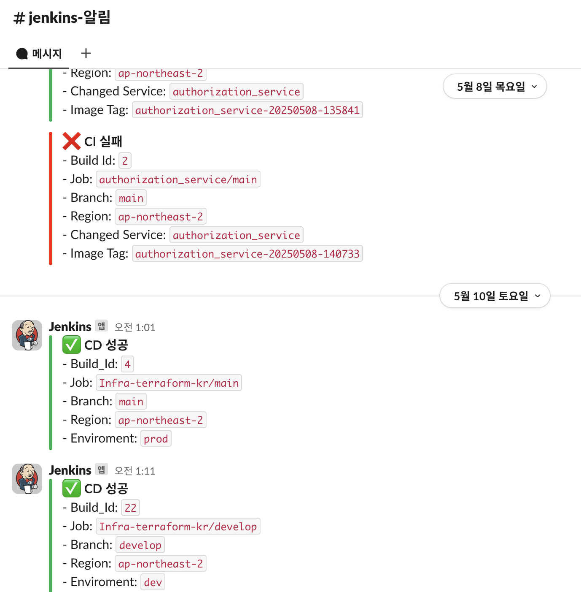
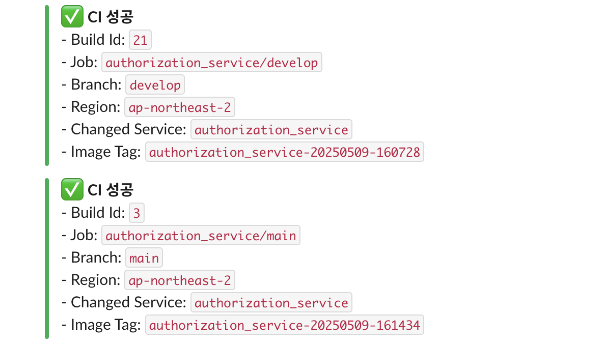

# 추가 프로젝트: Terraform IaC 환경 CI/CD 파이프라인 구축
> **기존 프로젝트:** AWS 기반 글로벌 식당 예약 서비스 🔗 [Kyobo-CDA1-9900](https://github.com/KJH0476/Kyobo-CDA1-9900) 
> **IaC 구현 내용 README:** 🔗 [IaC/README.md](https://github.com/KJH0476/cicd-with-iac/tree/main/IaC) 
> **기간:** 2025/04/18 ~ 2025/05/16 (1개월) 
> **인원:** 1명 (개인 프로젝트)
---

## 개요
기존 프로젝트는 Terraform을 사용해 ECS 서비스를 생성하고 관리합니다. 
그런데 해당 프로젝트에 CI/CD 파이프라인을 구현하고, 이를 통해 ECS 애플리케이션을 배포하게 되면 **Terraform state와 실제 인프라 상태가 불일치하여 충돌이 발생**하지 않을까 하는 의문이 들었습니다. 
이런 의문을 해소하고, CI/CD를 보다 깊게 학습하고자 해당 프로젝트를 시작했습니다.

## 요구사항
- [x] 기존 services/ IaC/ 폴더 구성을 그대로 사용한다.
- [x] ap-northeast-2·us-east-1의 dev/prod에 개별 배포한다.
- [x] 애플리케이션 CD와 테라폼 CD가 각각 분리되어야한다.
- [x] GitHub 레포를 단일 소스로 삼아 모든 변경을 커밋으로 추적해 GitOps 원칙을 준수한다.
- [x] 모든 Jenkinsfile을 레포 내부에 두고 버전 관리한다.
- [x] AWS Key, Slack 토큰, Git SSH 정보는 Jenkins Credentials에만 저장한다.
- [x] Terraform으로 ECS를 관리하기 때문에 새로운 서비스 배포시 Terraform State와 충돌이 없어야한다.
- [x] 기존 Terraform 코드 구조를 크게 변경하지 않고 CI/CD를 구현한다.
- [x] dev 환경 배포 후 관리자가 승인하는 경우에만 prod 환경에 배포한다.
- [x] 파이프라인 성공/실패 결과를 Slack으로 알림을 보낸다.

## 시나리오 순서
> **📌 CI 파이프라인 요약**
> - **develop**: 이미지 빌드 & ECR Push → `tfvars` 수정 → develop 브랜치 커밋 & 푸시 → 테스트 승인 시 candidate 태그 부여 및 푸시
> - **main**: candidate 태그 승격 & ECR Push → Prod `tfvars` 수정 → main 브랜치 커밋 & 푸시

1. 여러 변경사항이 develop으로 푸시&머지 됨
2. develop 브랜치로 푸시되면 해당 파이프라인 동작
3. 리전을 선택함(ap-northeast-2, us-east-1)
4. dev용 도커 이미지 생성 및 푸시(CI)
5. 이미지각 레포에 푸시되면 IaC/리전/dev에 있는 tfvars의 이미지 url을 푸시한 이미지로 변경
6. 해당 변경사항을 develop 브랜치에 푸시하여 IaC 를 담당하는 CD 파이프라인이 트리거되어 실제 테스트를 수행함
7. develop 에 배포된 애플리케이션 테스트를 마친 후 승인하면 해당 이미지를 candidate 태그를 걸어서 새로 생성 후 푸시
8. 개발자가 수동으로 develop → main 브랜치에 머지하는 PR 생성 (7번 단계에서 자동으로 PR을 올리도록 구성해도 좋을듯함)
9. PR이 승인되어 main에 머지되면 해당 Jenkinsfile 다시 동작 여기선 when 조건으로 main 브랜치일때 동작하는 CI 스텝만 실행됨
10. IaC/리전/dev 의 배포된 이미지(candidate 태그가진 이미지)를 ECR에서 가져와서 IaC/리전/prod 의 tfvars 이미지 url 부분에 설정
11. 해당 변경사항을 main 브랜치에 푸시해 IaC를 담당하는 CD 파이프라인이 트리거되어 실제 운영 인프라에 반영됨

> **📌 CD 파이프라인 요약**
> - **develop**: `IaC/리전/dev` 디렉토리로 이동 → `terraform init` → `validate` → `plan` → `apply`
> - **main**: `IaC/리전/prod` 디렉토리로 이동→ `terraform init` → `validate` → `plan` → `apply`

1. Github 체크아웃
2. IaC/리전/(dev or prod) 디렉토리로 이동
3. terraform init → validate → plan → apply 수행

## 순서도

## 참고 화면
> 서비스별 CI 파이프라인 & Terraform CD 파이프라인

    
    

> Slack 알림

    
    

